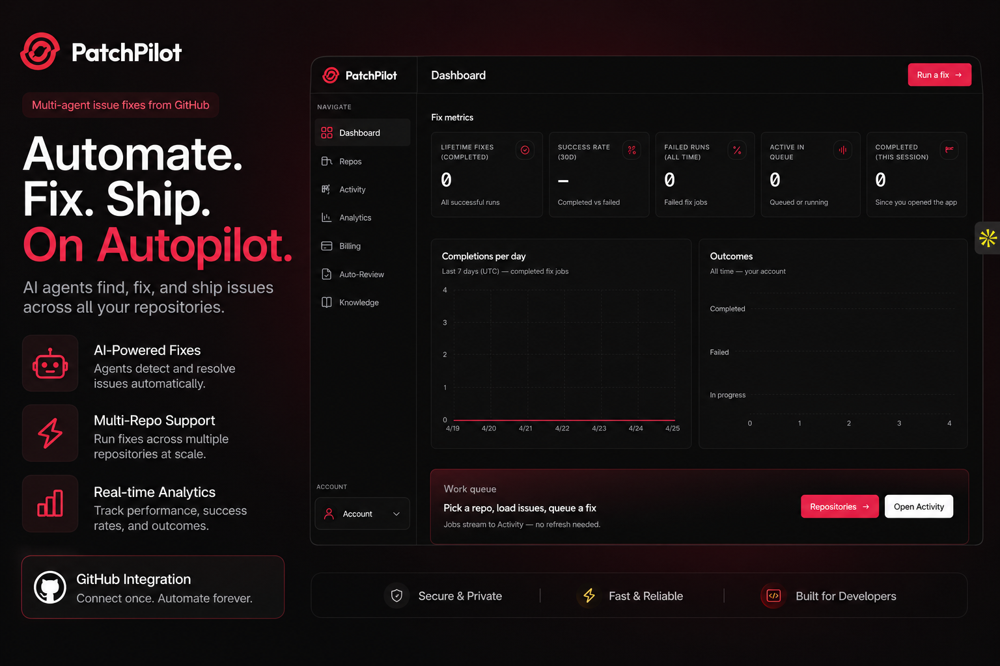

# PatchPilot

**Multi-agent issue fixes from GitHub.** PatchPilot automates the path from a GitHub issue to a pull request: AI agents read your codebase, plan changes, write patches and tests, and open a PR—while the dashboard and analytics help you run fixes at scale.

<p align="center">
  
</p>

<p align="center">
  <em>Dashboard: run fixes, track lifetime completions, success rate, queue depth, and daily outcomes.</em>
</p>

---

## Features

- **AI-powered fix pipeline** — A LangGraph workflow: code exploration → plan → implement → tests → open PR (see `backend/app/core/graph/workflow.py`).
- **Multi-repo support** — Connect GitHub, pick repositories, load issues, and queue fixes from the app shell (`Repos`, `queue` / Activity).
- **Real-time job queue** — Fix jobs run via Redis and RQ; the UI streams progress without manual refresh (`JobQueueContext`, Activity).
- **Analytics** — Completions, outcomes, and trends (Recharts on the Analytics page).
- **GitHub integration** — OAuth sign-in, repo and issue access, and PR automation. Auto-Review can install a webhook for AI-assisted review on PRs.
- **Billing** — Dodo Payments integration for subscription plans (Pro / Pro+), exposed under Billing in the app.

## Architecture

| Layer | Stack |
|--------|--------|
| **Web app** | [Next.js](https://nextjs.org/) 16 (App Router), React 19, Tailwind CSS 4, Framer Motion, Recharts |
| **API** | [FastAPI](https://fastapi.tiangolo.com/), CORS enabled for the frontend |
| **Data** | PostgreSQL (SQLAlchemy; connection via `DATABASE_URL` / `DB_URL`) |
| **Jobs** | [Redis](https://redis.io/) + [RQ](https://python-rq.org/) for background fix jobs |
| **AI** | [LangGraph](https://github.com/langchain-ai/langgraph) + LangChain OpenAI client (see LLM config in `backend/app/core/tools/llm.py`) |
| **Payments** | [Dodo Payments](https://dodopayments.com/) webhooks and checkout |

Repository layout:

```text
multi-agent-orchestrator/
├── client/                 # Next.js frontend (run from here for `pnpm dev`)
├── backend/                # FastAPI app, workers, LangGraph agents
│   ├── app/api/            # REST: auth, repos, issues, fix jobs, billing, webhooks, review
│   ├── app/core/agents/    # Planner, code reader/writer, tests, PR agent
│   ├── app/workers/        # RQ worker entrypoint
│   └── .env.example        # Environment template
├── pyproject.toml          # Python deps (uv or pip)
└── main.py                 # Optional local graph smoke test
```

## Prerequisites

- **Python 3.12+**
- **Node.js** 20+ (for the client; repo uses `pnpm` — see `client/pnpm-lock.yaml`)
- **Redis** (local default: `redis://127.0.0.1:6379/0` if `REDIS_URL` is unset)
- **PostgreSQL** (e.g. [Neon](https://neon.tech/) or any Postgres with SSL as required by your host)
- **External services**
  - [GitHub OAuth app](https://docs.github.com/en/apps/oauth-apps) — `GITHUB_CLIENT_ID`, `GITHUB_CLIENT_SECRET`
  - [OpenRouter](https://openrouter.ai/) (or adjust `backend/app/core/tools/llm.py`) — `OPENROUTER_API_KEY` for the LLM
  - Optional: `GITHUB_TOKEN` for server-side GitHub API usage (and PR flow) in addition to per-user tokens where applicable
  - Optional: Dodo Payments keys for billing (`DODO_PAYMENTS_*` in `backend/.env.example`)

## Quick start

### 1. Clone and install

```bash
git clone <your-repo-url> multi-agent-orchestrator
cd multi-agent-orchestrator
```

**Python (from repo root, using [uv](https://docs.astral.sh/uv/)):**

```bash
uv sync
```

**Frontend:**

```bash
cd client
pnpm install
cd ..
```

### 2. Environment

Copy the backend template and fill in secrets:

```bash
cp backend/.env.example backend/.env
# Edit backend/.env — at minimum: DATABASE_URL (or DB_URL), JWT_SECRET, GitHub OAuth, OPENROUTER_API_KEY
```

The backend loads env from the repo root `.env` and/or `backend/.env` (see `backend/app/core/config.py`).

**Frontend API URL** — create `client/.env.local` for production or non-default API hosts:

```bash
NEXT_PUBLIC_API_URL=http://localhost:8000
```

If omitted, the client defaults to `http://localhost:8000` (`client/lib/api.ts`).

### 3. Run Redis

```bash
redis-server
# or use a managed Redis and set REDIS_URL in .env
```

### 4. Run the API

From the **backend** directory so the `app` package resolves:

```bash
cd backend
uv run uvicorn app.api.main:app --reload --host 0.0.0.0 --port 8000
```

### 5. Run the RQ worker

In another terminal (also from `backend/`):

```bash
cd backend
uv run python -m app.workers.worker
```

### 6. Run the Next.js app

```bash
cd client
pnpm dev
```

Open [http://localhost:3000](http://localhost:3000). API health: [http://localhost:8000/](http://localhost:8000/) (root returns a short JSON message).

## Production deployment (checklist)

- Set **secure** `JWT_SECRET`, **HTTPS** URLs for `FRONTEND_URL` and `APP_PUBLIC_URL`, and production **PostgreSQL** + **Redis** (`REDIS_URL`).
- Register OAuth callback URLs that match your deployed frontend and API routes (`next.config.ts` rewrites GitHub callback to the API).
- Configure **Dodo** webhook URL and product IDs for live billing if you use payments.
- Build the client: `cd client && pnpm build && pnpm start` (or deploy to Vercel / similar) and run the API + workers on your host or container platform.

## Development notes

- **Local workflow test:** `uv run python main.py` at repo root (invokes the compiled LangGraph; writes patch/test outputs) — useful for agent debugging, separate from the full HTTP + RQ path.
- **OpenRouter model** is configured in `backend/app/core/tools/llm.py`; change model or provider there if you standardize on OpenAI or another base URL.
- The client follows Next.js 16 conventions; see `client/AGENTS.md` for project-specific agent notes.

## License

Add your license (e.g. MIT) in a `LICENSE` file at the repo root when you publish.

---

<p align="center">
  <strong>PatchPilot</strong> — Automate. Fix. Ship. On autopilot.
</p>
